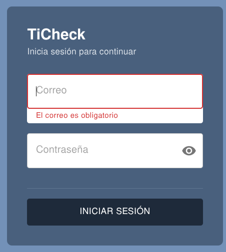

# Suite de Pruebas — Épica: Autenticación y Seguridad

## 1. Referencia

| Campo | Valor |
|---|---|
| Épica | Autenticación y Seguridad |
| HUs cubiertas | HU Login, HU Protección de Rutas |
| Versión del documento | v1.3 |
| Responsable de redacción | QA |
| Fecha | 30/08/2026 |
| Test Planning General | [Link al documento general]() |

## 2. Alcance del suite

Esta suite de pruebas comprende las HUs Login y Protección de Rutas, validando el cumplimiento de los criterios de aceptación, la integración entre frontend y backend (endpoint de autenticación, guardas de ruteo, control de acceso por rol) y la paridad entre el diseño en Figma y el producto implementado. Esta version del suite prioriza los casos criticos y de mas alto riesgo.

Queda fuera de este alcance: pruebas de accesibilidad, compatibilidad cross-browser/cross-device y estudios de satisfacción del cliente. Se incluyen, de forma acotada, un par de validaciones no funcionales (rendimiento y seguridad basica) solicitadas para esta ronda.

## 3. Criterios de entrada

- [ ] Cumplimiento de la fase de desarrollo, ya integrado a la branch de pruebas.
- [ ] Seed de usuarios (con al menos un perfil Agente y un perfil Supervisor) cargado previamente en el entorno de pruebas.
- [ ] HUs marcadas como "Ready for QA".
- [ ] Endpoint de autenticación desplegado y accesible en el ambiente de pruebas.
- [ ] Acceso al diseño de Figma vigente para contraste de paridad FE.

## 4. Criterios de salida específicos

Condiciones de salida generales:

- [ ] ¿Las HUs cumplen con el DoD propio?

Condiciones específicas de esta suite:

- [ ] Cobertura de los criterios de aceptación priorizados como críticos o altos en la matriz de trazabilidad.
- [ ] 0 defectos críticos o altos abiertos relacionados con control de acceso por rol (AC2 de HU Protección de Rutas).
- [ ] Refinamiento pendiente de la HU Login: aclarar con el PO la duplicidad de numeración de "AC4" (Campo contraseña / Diseño FE / Redirección a dashboard) antes del cierre del suite.
- [ ] Mensajes de validación y error verificados textualmente contra lo especificado en los AC.
- [ ] Confirmar con el PO la regla de negocio para cuando un Supervisor intenta acceder a una vista exclusiva de Agente (no esta definida en la HU actual).

## 5. Técnicas de prueba aplicadas en este suite

- Partición de equivalencia
- Análisis de valores límite
- Tabla de decisión
- Prueba de transición de estados
- Error guessing (basada en experiencia)
- Revisión / prueba estática (si aplica a HUs o CA ambiguos)

## 6. Riesgos específicos de la épica

| Riesgo | Probabilidad | Impacto | Prioridad resultante | Mitigación |
|---|---|---|---|---|
| Fuga de datos o acceso cruzado entre Agente y Supervisor por URL directa o bypass del FE | Media | Alto | Crítico | CP-03, CP-04 |
| Login exitoso otorgado con credenciales inválidas o sesion incorrecta | Media | Alto | Crítico | CP-01, CP-02 |

## 7. Matriz de trazabilidad (criterios de aceptación → casos prioritarios)

| HU | Criterio clave | Caso(s) apoyados |
|---|---|---|
| HU Login | Credenciales válidas permiten iniciar sesión | CP-01 |
| HU Login | Credenciales inválidas bloquean acceso | CP-02 |
| HU Protección de rutas | Bloqueo de acceso cruzado por rol | CP-03 |
| HU Protección de rutas | Validación del backend sin FE | CP-04 |

## 8. Hallazgos técnicos detectados durante análisis

| ID | Hallazgo detectado | Impacto | Severidad | Recomendación |
|---|---|---|---|---|
| H-01 | El backend usa `role === 'user'` para identificar al Agente, pero la semántica del negocio y el seed no son consistentes (`agente` vs `user`). | Puede bloquear o permitir accesos incorrectos por rol. | Crítico | Agregar caso de prueba de normalización de roles y validación del JWT en backend. |
| H-02 | El flujo de rutas protegidas requiere validación manual en navegador para confirmar redirección real; la regla backend no reemplaza la validación de UI. | Riesgo de UX y de acceso cruzado si la navegación se rompe. | Crítico | Mantener la validación visual en frontend y el chequeo backend como complemento. |

## 9. Casos de prueba prioritarios (críticos y altos)

| ID | Qué se va a probar | Técnica | Módulo | Tipo de prueba | Prioridad | Criterio de cierre | Ejecutado | Resultado | Comentarios | Evidencia |
|---|---|---|---|---|---|---|---|---|---|---|
| CP-01 | Validar login exitoso para Agente y Supervisor con credenciales válidas. | Tabla de decisión (rol × credenciales válidas) | Login | Funcional (manual FE + integración backend) | Crítico | Se cierra cuando ambos roles logran iniciar sesión, se guarda el token/rol y el flujo redirige al dashboard correcto sin errores. | Sí | Aprobado | Se validó el backend con login exitoso y generación de token/rol para un usuario autenticado. | `apps/back/src/app/auth/tests/backend-auth-security/backend-auth-security.spec.ts` |
| CP-02 | Verificar que credenciales incorrectas no permiten acceder y muestran el error esperado. | Partición de equivalencia (válido vs. inválido) | Login | Funcional (manual FE + integración backend) | Crítico | Se cierra cuando la combinación inválida devuelve error consistente y no se genera sesión ni acceso a rutas protegidas. | Sí | Aprobado | Se validó que usuario inexistente y contraseña incorrecta lanzan `UnauthorizedException` con el mensaje esperado. | `apps/back/src/app/auth/tests/backend-auth-security/backend-auth-security.spec.ts` |
| CP-03 | Validar bloqueo del acceso cruzado entre roles usando URL directa y sesiones autenticadas. | Partición de equivalencia + error guessing | Protección de rutas | Funcional manual (Frontend) + integración backend | Crítico | Se cierra cuando Agente no entra a rutas de Supervisor y viceversa, con redirección o 403, sin exponer datos del otro rol. | No | aprobado | El acceso a las rutas se ve bloqueado para tickets o rutas en los cuales no son de la propiedad, te redirige al dashboard en caso de ingresar a un link restringido. | N/A |
| CP-04 | Validar que el backend rechaza acceso directo a recursos protegidos aunque se bypassée la interfaz. | Error guessing + partición de equivalencia | Protección de rutas | Integración backend | Crítico | Se cierra cuando cualquier petición directa con token de un rol sin permiso devuelve 403/401 y no expone datos ajenos. | Sí | Aprobado | Se validó la regla de aislamiento que bloquea acceso a ticket ajeno para Agente con `403` y sin exponer datos. | `apps/back/src/app/tickets/tests/isolation-guard/isolation-guard.spec.ts` |
| CP-05 | Validar que el rol `agente` y el rol `user` son tratados de forma homogénea en backend y no provocan errores de autorización. | Partición de equivalencia (roles equivalentes) | Seguridad / auth | Integración backend | Crítico | Se cierra cuando el servicio normaliza y autoriza correctamente ambos nombres de rol y no deja usuarios sin permisos ni con acceso indebido. | No | Pendiente | Hallazgo detectado por análisis técnico; requiere validación real de seed y token. | N/A |
| CP-06 | Validar el caso de Supervisor intentando acceder a una vista o recurso exclusivo de Agente. | Error guessing + partición de equivalencia | Protección de rutas | Funcional manual (Frontend) + integración backend | Alto | Se cierra cuando supervisor no puede acceder a vistas exclusivas de Agente y recibe bloqueo, redirección o 403. | No | Pendiente | El comportamiento no quedó definido en la HU y debe confirmarse con el PO. | N/A |
| CP-07 | Validar mensajes de error en el formulario de login para campos vacíos, inválidos e incorrectos. | Tabla de decisión (email × contraseña × validez) | Login | Funcional manual (Frontend) | Crítico | Se cierra cuando todos los escenarios de la tabla de decisión muestran el mensaje correcto en pantalla sin permitir envío o con redirección exitosa. | No | No aprobada | En el caso cuando se selecciona el boton con ninguo de lo campos llenos, solamente se muestra el mensaje de campo mandatorio en el campode correo, deberia aparecer enambos |  |

## 10. Tabla de Decisión detallada — CP-07: Mensajes de validación en Login

| ID | Email | Contraseña | Estado Email | Estado Contraseña | Mensaje esperado (Email) | Mensaje esperado (Contraseña) | Acción esperada | Resultado |
|---|---|---|---|---|---|---|---|---|
| TD-01 | (vacío) | (vacío) | Obligatorio | Obligatorio | El correo es obligatorio | La contraseña es obligatoria | No envía formulario | Pendiente |
| TD-02 | (vacío) | `Pass1234!` | Obligatorio | Válido | El correo es obligatorio | (sin error) | No envía formulario | Pendiente |
| TD-03 | `user@test.com` | (vacío) | Válido | Obligatorio | (sin error) | La contraseña es obligatoria | No envía formulario | Pendiente |
| TD-04 | `formato_invalido` | `Pass1234!` | Inválido | Válido | El correo no tiene un formato válido | (sin error) | No envía formulario | Pendiente |
| TD-05 | `user@test.com` | `Pass` | Válido | Inválido | (sin error) | La contraseña debe tener al menos 6 caracteres | No envía formulario | Pendiente |
| TD-06 | `noexiste@test.com` | `Pass1234!` | Válido | Válido | (sin error) | (sin error) | Envía y muestra error en Snackbar | El usuario o contraseña es incorrecto, intente de nuevo |
| TD-07 | `user@test.com` | `IncorrectPassword123!` | Válido | Válido | (sin error) | (sin error) | Envía y muestra error en Snackbar | El usuario o contraseña es incorrecto, intente de nuevo |
| TD-08 | `admin@test.com` | `admin123` | Válido | Válido | (sin error) | (sin error) | Envía y redirige al dashboard | Redirección exitosa a `/main_screen` |

### Precondiciones:
- El navegador está en la página de login (`/login`).
- Los usuarios seed están cargados en la base de datos:
  - `admin@test.com` / `admin123` (rol: admin)
  - `user@test.com` / `user123` (rol: user)

### Criterios de validación de mensaje (Coincidencia textual exacta):
1. **Campo correo obligatorio**: "El correo es obligatorio"
2. **Formato correo inválido**: "El correo no tiene un formato válido"
3. **Campo contraseña obligatorio**: "La contraseña es obligatoria"
4. **Contraseña mínimo 6 caracteres**: "La contraseña debe tener al menos 6 caracteres"
5. **Credenciales incorrectas (Snackbar)**: "El usuario o contraseña es incorrecto, intente de nuevo"
6. **Error del servidor (Snackbar)**: "Ocurrió un error inesperado al procesar la solicitud."

### Pasos del escenario por tabla de decisión (ejemplo para TD-06):

1. **Ingreso de datos**:
   - Email: `noexiste@test.com`
   - Contraseña: `Pass1234!`

2. **Validaciones esperadas en el campo**:
   - Email no debe mostrar error visual (ícono rojo, borde rojo).
   - Contraseña no debe mostrar error visual.

3. **Acción del usuario**:
   - Click en botón "Iniciar Sesión".

4. **Resultado esperado**:
   - El botón cambia a estado "Ingresando..." durante 600 ms (tiempo de mock).
   - Aparece un `Alert` rojo (Snackbar) en la parte inferior con el mensaje: "El usuario o contraseña es incorrecto, intente de nuevo".
   - El usuario NO es redirigido.
   - Los campos conservan los valores ingresados.

### Dependencias técnicas verificadas:

- Componente `LoginForm.tsx` valida en cliente y muestra `helperText` rojo para errores en campos.
- Validaciones frontend aplicadas: `isValidEmail()` + validaciones de campo obligatorio.
- Endpoint `/api/v1/auth/login` (mock) devuelve error 401 con mensaje "Las credenciales son incorrectas".
- Redux `authSlice` mapea error 401 a: "El usuario o contraseña es incorrecto, intente de nuevo".
- `Snackbar` + `Alert` mostrados cuando `status === 'failed'` y `errorMessage` no es vacío.

### Notas adicionales:

- **Mensaje de redirección exitosa**: Después de login exitoso (TD-08), el componente ejecuta `router.push('/main_screen')` sin mostrar un Snackbar.
- **Validación en backend**: El backend también valida email con `@IsEmail()` y contraseña con `@MinLength(6)`, pero estas reglas se aplican en peticiones **directas** sin validación FE.
- **Coincidencia exacta de mensajes**: Es crítico validar que los mensajes mostrados coincidan **textualmente** con los especificados en los criterios (sin mayúsculas/minúsculas adicionales).

## 10. Resumen de cobertura

| Métrica | Valor |
|---|---|
| Total de casos diseñados | 7 |
| Casos críticos | 6 |
| Casos de prioridad alta | 1 |
| Casos ejecutados | 3 |
| Casos aprobados | 3 |
| Casos fallidos | 0 |
| Casos bloqueados | 0 |
| Escenarios de tabla de decisión (CP-07) | 8 |
| Criterio de cierre de la suite | Se aprueba cuando los casos backend automatizados quedan verdes, los casos de acceso cruzado por rol se validan manualmente con flujo real del usuario, y CP-07 valida manualmente que cada escenario de la tabla de decisión muestra el mensaje correcto. |