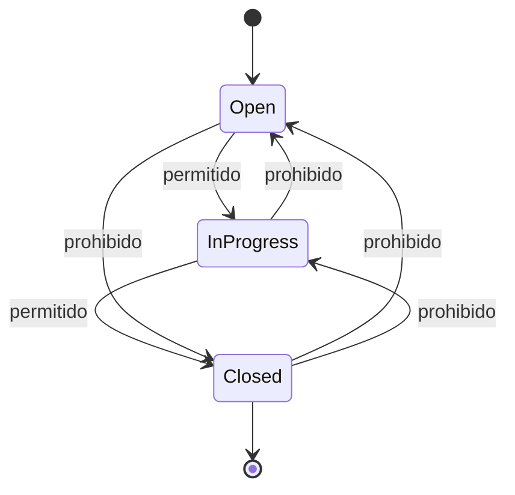

# Prueba unitaria del guard de aislamiento de tickets

## Alcance

Se validó el comportamiento del backend para un Agente cuando intenta:

- consultar un ticket que no le pertenece,
- editar un ticket ajeno,
- reasignar un ticket a otro agente,
- ejecutar transiciones de estado inválidas,
- reabrir un ticket cerrado.

## Técnica utilizada

Se aplicó la técnica de partición de equivalencia:

- Grupo válido: transiciones permitidas para tickets del agente propietario.
- Grupo no válido: tickets ajenos, reasignaciones a otro agente y transiciones prohibidas.
- Se probó al menos un caso de cada clase para verificar la regresión y el bloqueo por aislamiento.

## HUs implicadas

- HU06_Creacion_Tickets
- U07_Edicion_Tickets
- Contrato_Integracion

Los criterios que guiaron la prueba fueron:

- un Agente solo puede consultar tickets asignados a él,
- un Agente no puede modificar tickets que no son suyos,
- no puede reasignar un ticket a otro agente,
- los tickets nacen abiertos y solo se permiten transiciones válidas,
- un ticket cerrado no puede reabrirse por un Agente.

## Set de datos

Se usaron tickets de prueba con estos valores:

- Agente propietario: `agent-001`
- Agente ajeno: `agent-002`
- Ticket propio: `ticket-100` asignado a `agent-001`
- Ticket ajeno: `ticket-200` asignado a `agent-002`
- Estados probados:
  - `open`
  - `in_progress`
  - `closed`

## Criterio de evaluación

La prueba pasa si:

- el backend responde `200` en el caso propio y válido,
- responde `403` cuando el agente intenta acceder o editar un recurso ajeno,
- responde `409` cuando se intenta una transición prohibida,
- no permite reasignar a un agente distinto,
- la lógica de aislamiento se cumple aunque la petición llegue directamente al backend sin pasar por el formulario del frontend.

## Diagrama de transiciones esperado

## Resultado esperado del backend

Se espera que el backend haga estas comprobaciones en la capa de servicio o guardia antes de ejecutar la actualización:

- `if role === 'user' and ticket.assignedTo.uuid !== currentUser.uuid => 403`
- `if assignedToUuid !== currentUser.uuid para un agente => 403`
- `if transition not in allowed map => 409`
- `if currentStatus === closed and nextStatus === open => 409`

Esto mantiene la regla de aislamiento por usuario y la integridad de los estados del ticket.
